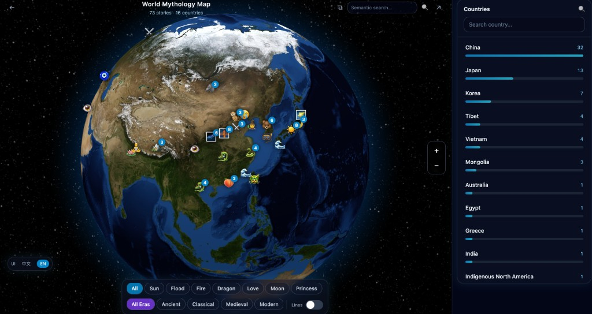

# MythAtlas

**World Mythology Map** — explore myths and folklore on an interactive 3D globe. Stories are pinned as emoji markers; zoom in for clustering, city labels, and a detail panel with bilingual text.

<p align="center">
  
</p>

## About MythAtlas

MythAtlas treats **place** as the spine of narrative: a legend belongs somewhere—an island, a capital, a mountain pass—so you can **browse the planet** the way travelers swap stories. The app is for anyone mapping *how* cultures explain the world: gods, tricksters, founding heroes, seasonal rites, and moral tales passed down outside formal history books.

Content is **stored bilingually** (English / Chinese) in the database when you provide both; the globe and filters help you narrow by **country**, **theme** (e.g. dragon, love, flood), and **era tag**, with optional **semantic search** when embeddings are enabled.

### Folklore examples (illustrative)

The kinds of traditions MythAtlas is meant to hold—not an exhaustive list, and your live dataset depends on seeds and imports:

| Tradition | Tale (short hook) |
| --- | --- |
| **China** | *Chang’e* — the moon, the elixir of immortality, and separation from the earth below. |
| **China** | *Meng Jiangnü* — grief and the Great Wall as a monument to human cost, not only stone. |
| **Japan** | *Amaterasu* — light locked in a cave; *Urashima Tarō* — the palace under the sea and lost time. |
| **Japan** | *Momotaro* — the peach boy, animal allies, and the oni island. |
| **Korea** | *Dangun* — bear, tiger, and the founding of the first kingdom; *Chunhyang* — fidelity across class. |
| **Vietnam** | *Lạc Long Quân* & *Âu Cơ* — dragon and fairy ancestors of the people. |
| **Mongolia / steppe** | *Erlik* or epic cycles — underworld, horses, and sky-worship in oral epic. |
| **West Africa** | *Anansi* — wit, contracts with the sky god, and who “owns” the stories. |
| **Greece** | Hero shrines and islands — *Odyssey*-scale wandering or local oracle lore tied to real geography. |

---

## What it does

| | |
| --- | --- |
| **Globe** | `react-globe.gl` · emoji markers · zoom-based clustering · English place names (Natural Earth) when zoomed in |
| **App** | Theme & era filters · country sidebar · semantic search (with optional OpenAI embeddings) |
| **API** | FastAPI · PostGIS geography · pgvector search · bilingual content stored in PostgreSQL |

---

## Run with Docker

**Requires:** [Docker](https://docs.docker.com/get-docker/) + Compose v2.

```bash
cp .env.example .env
# Optional: set OPENAI_API_KEY and ADMIN_TOKEN in .env
docker compose up --build
```

| Service | URL |
| --- | --- |
| **App** (nginx → UI + `/api` proxy) | [http://localhost:8080](http://localhost:8080) |
| **API** (direct) | [http://localhost:8000/api](http://localhost:8000/api) |
| **Postgres** | `localhost:5432` · user / pass / db: `mythatlas` |

First boot: Alembic migrations + seed data.  
Custom DB image: `docker/db` — PostgreSQL 16 + **PostGIS** + **pgvector** (plain PostGIS images lack `vector`).

**Reset database** (wipes volume): `docker compose down -v`

---

## Layout

```
backend/    FastAPI · Alembic · scripts
frontend/   Vite · React · TypeScript · Tailwind
docker/     DB image
docs/       Showcase asset
```

---

## License

Sample narrative content is for demonstration. See repository for license terms.

---

<p align="center"><sub>世界神话地图 · MythAtlas</sub></p>
